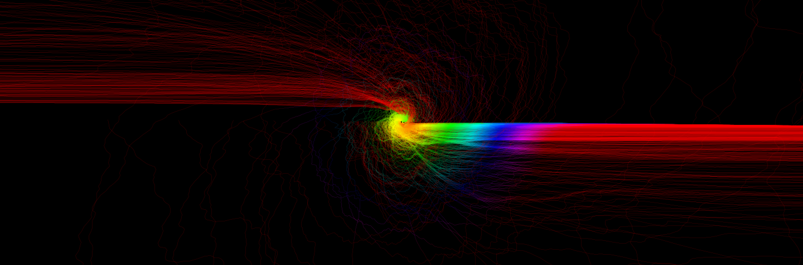
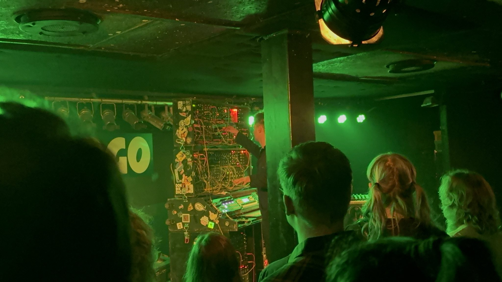

# FUSION CORE (synthesizer)

## Aims

- No aim lol
- Get to know delicious circuits (experimenting a lot)
- Use them in crude ways to generate sounds
- Learn how to design circuits & professionally manufacture them with KiCad
- Learn whats possible with analog circuits and what's not
- Have a lot of fun without the need of programming

- Get an overview of electronic parts out there
- Manage a big project
- Make ambient dub techno at the end lol

## Resources
- Books
    - Make: Analog Synthesizers (from Music from outer space)
    - The Art of Electronics
    - Make: Electronics & Make: More Electronics
    - Encyclopedia of Electronic Components (Vol. 1, Vol. 2, Vol. 3)
    - Engineers Mini-Notebooks
- Internet
    - https://www.lookmumnocomputer.com/
    - https://www.eddybergman.com/
    - https://www.birthofasynth.com/Thomas_Henry/TH_main.html
    - https://musicfromouterspace.com/
    - https://www.schmitzbits.de/index.html
    - https://www.ericasynths.lv/
    - and a lot more!
- University for background theory
    - Electronics I & II
    - Signals & Systems, Control Systems
    - Communications Engineering
    - Computer Engineering

## Gallery

DIY dual 12V power supply + 5V (combined switched mode & linear regulated)

My first module! Still very early, but reliable 1V/oct frequency control and all outputs (Triangle, Saw, Rectangle) have the same voltage levels

Obviously go to Look Mum no Computer concert!

Test circuits with chaotic wiring

Borrow devices from student research center

## Module Specifications
- ±12V, 5V Power Supply
- 16cm high, n * 2cm wide (Eurorack is too small, Cosmo too large)

- PCB-Color: Green
- Different front-plate materials (wooden, metal, PVC)

# Level 1: Basic Synth

## Chapter 1: Case
- It should be a wooden box sprayed black with fancy neon art or something

## Chapter 2: PSU
- found a better one than my own diy thing (RT65-B)

## Chapter 3: 3x VCO 
- still experimenting and learning how to design modules with input / output protection
- but first VCO tests work based on AS3340/CEM3340

Knobs:
- Big Frequency Knob
- Fine Frequency Knob
- PWM Knob

Inputs:
- PWM
- 1V/Oct
- Hard Sync
- Soft Sync

Outputs:
- Triangle
- Sawtooth
- Rectangle

## Chapter 4: 2x VCF
- First design workes based on LM13700 Operational Transconductance Amplifier, but I want to make sure it workes in every situation and the output is in voltage bounds

Knobs:
- Cutoff
- Resonance
- Drive

Inputs:
- Cutoff
- Resonance
- Drive

Output:
- Low Pass
- Band pass
- High Pass

## Chapter 5: 4x VCA

VU Meter?

Knobs:
- Volume

Inputs:
- Audio in
- CV in

Outputs:
- Audio out

## Chapter 6: 2x 4-channel Mixer
Knobs:
- Channel 1 Volume
- Channel 2 Volume
- Channel 3 Volume
- Channel 4 Volume

Inputs:
- Audio Channel 1
- Audio Channel 2
- Audio Channel 3
- Audio Channel 4

Output
- Audio Sum

## Chapter 7: Teensy 4.1 as digital signal processor for reverb / echo / distortion effects

Knobs:
- Mode
- Mod 1 (Reverb Room Size    / Echo Clock Speed)
- Mod 2 (Reverb Decay Length / Echo Feedback)

Input:
- Left Audio In
- Optional Right Audio In
- Mod 1 (Reverb Room Size    / Echo Clock Speed)

Output:
- Left Audio Out
- Right Audio Out

## Chapter 8: Audio Out (Headphones, Line Out)
- Input buffering Input / Output durch OpAmp?

- Dual Mono to Stereo
- Headphone Out
- Volume Knob
- Vu Meter

# Level 3: LMNC AAAPPPCCC Module

# Level 4: Triangle to Sine Wave Conversion

# Level 5: Beat Extension

## Chapter 1: Splitter

## Chapter 2: Clock

## Chapter 3: Clock Divider

## Chapter 4: Counter

## Chapter 5: ADSR

## Chapter 6: Manual Trigger / Gate

## Chapter 7: Sample & Hold

## Chapter 8: LFO

## Chapter 9: Constant voltage source

## Chapter 10: Signal voltage offset